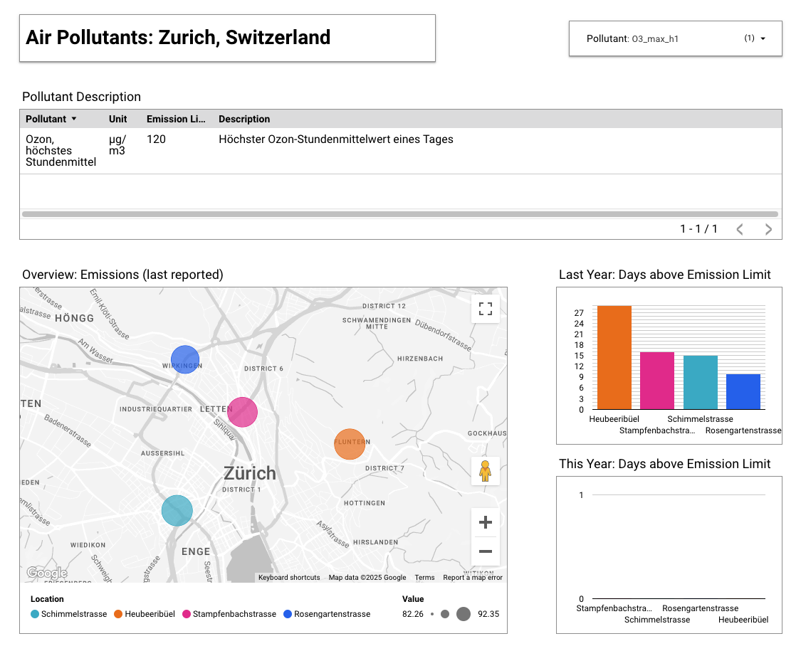

# End-to-end Data Pipeline: Zurich Air Quality Data



## Project Overview

This project is my final submission for the Data Engineering Zoomcamp (cohort 2025). For this project I built a batch data pipeline that automatically updates daily, leveraging modern cloud and containerization technologies. The data used in this project is provided by the City of Zurich with an open source Creative Commons License (cc-zero).

Public Links:
- [raw data](https://data.stadt-zuerich.ch/dataset/ugz_luftschadstoffmessung_tageswerte)
- [dashboard](https://lookerstudio.google.com/reporting/f96397ee-34dc-4b35-a1e6-bcc93d6708ef)

## Technologies Used

The project utilizes the following technologies:

- **Docker & Docker Compose**: For containerization and orchestration ([Docker](https://www.docker.com/), [Docker Compose](https://docs.docker.com/compose/)).
- **Google Cloud Virtual Machine (VM) with Scheduling**: To run automated data workflows ([Google Compute Engine](https://cloud.google.com/compute)).
- **Kestra**: Orchestrating workflows in a scalable manner ([Kestra](https://kestra.io/)).
- **BigQuery**: Cloud-based data warehouse for storing and querying data ([BigQuery](https://cloud.google.com/bigquery)).
- **Dataform**: Automated data transformations (modeling) in BigQuery ([Dataform](https://dataform.co/)).
- **Looker Studio**: Creating visualizations and reports ([Looker Studio](https://lookerstudio.google.com/)).
- **GitHub**: Version control and project management ([GitHub](https://github.com/)).

## Project Architecture

The project follows a structured data pipeline:

### Data Extraction

Extracts raw data from the City's Open Data Catalog.

### Data Ingestion

Uses Kestra in Dockerized containers to process and upload data to Google Cloud Storage.

### Orchestration

Kestra schedules and triggers workflows to process data and load it into BigQuery tables.

### Data Transformation

Dataform is used to apply transformations and define the data model in BigQuery.

### Data Storage & Querying

Processed data is stored in BigQuery for analytical queries.

### Visualization & Reporting

Looker Studio connects to BigQuery via Google Connected Sheets to generate low-cost reports and dashboards.

## Setup and Deployment

### Prerequisites

Ensure you have the following installed:

- Docker & Docker Compose
- Google Cloud SDK
- GitHub account with repository access

### Steps to Deploy

1. **Clone the repository**:
   ```bash
   git clone https://github.com/your-username/your-repository.git
   cd your-repository
   ```
2. **Setup Google Cloud VM**:
   - Create a VM instance on Google Cloud.
   - Configure a scheduling job to run scripts periodically.
   - Install necessary dependencies (Docker, Kestra, BigQuery SDK, etc.).
3. **Run Kestra for Workflow Management**:
   - Deploy Kestra using Docker Compose:
     ```bash
     docker-compose up -d
     ```
   - Configure workflows to automate data ingestion and transformations.
4. **Integrate with BigQuery**:
   - Set up datasets and tables in BigQuery.
   - Deploy Dataform transformations.
5. **Build Dashboards with Looker Studio**:
   - Connect Looker Studio to BigQuery.
   - Create interactive dashboards.

## Repository Structure

```
├── definitions/            # Dataform SQL transformations       
├── flows/                  # Kestra workflows
├── .gitignore              # Files to be ignored by git
├── LICENSE                 # MIT Open Source License
├── README.md               # Project readme file
├── docker-compose.yml      # Docker Compose configuration for Kestra
└── workflow_settings.yaml  # Dataform configurations
```

## Future Improvements

- Implement CI/CD pipelines for automated deployments.
- Enhance data quality checks and monitoring.
- Scale workflows for higher data volumes.

## Contact

For any questions or contributions, feel free to connect via [GitHub](https://github.com/Alessine) or [LinkedIn](https://www.linkedin.com/in/angela-niederberger/).

