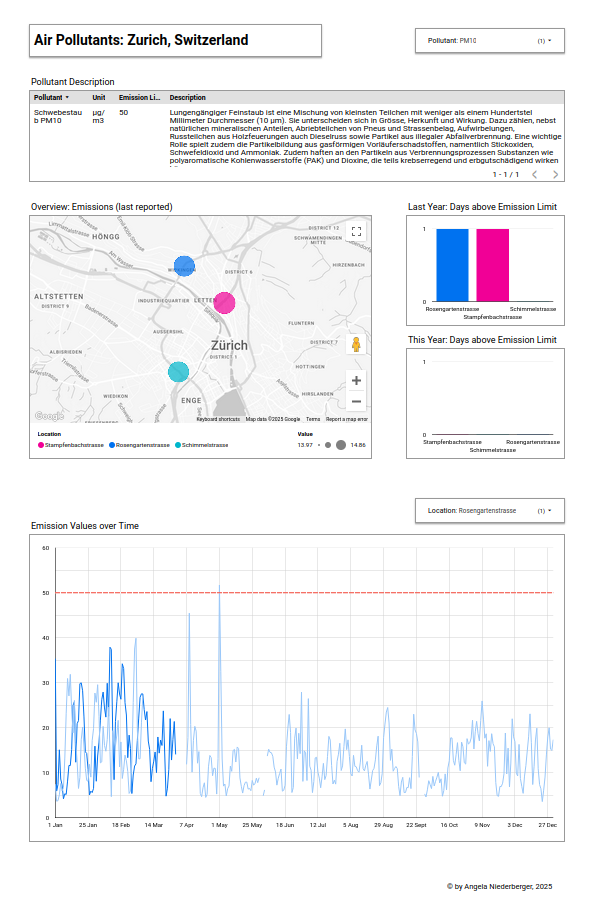

# End-to-end Data Pipeline: Zurich Air Quality Data


Photo by [Call Me Fred](https://unsplash.com/de/@callmefred) on [Unsplash](https://unsplash.com/de/fotos/luftaufnahme-der-stadt-uDLtqbbVR4I)

## Project Overview

This project is my final submission for the [Data Engineering Zoomcamp](https://github.com/DataTalksClub/data-engineering-zoomcamp) (cohort 2025). I built a batch data pipeline that automatically updates daily, leveraging modern cloud and containerization technologies. The data used in this project is provided by the City of Zurich with an open source Creative Commons License (cc-zero).

## Problem Statement

Air pollution is a serious public health issue in many cities in the world. I discovered years ago that my city publishes all of its measurements of air pollutants, but I didn't know how to make sense of this data. I wanted to create a visualization that gives a clear indication of how serious a certain level of pollution is, for each independent pollutant, and which also explains what this pollutant does. 

Therefore, I generated a dataset that contains the pollution measurements, but also emission limits and descriptions for each pollutant. For the visualization I then chose to calculate how many days in a year the pollution was higher than it should have been. This gives an intuitive understanding of how damaging the situation is.

## Technologies Used

The project utilizes the following technologies:

- **Docker & Docker Compose**: For containerization and orchestration ([Docker](https://www.docker.com/), [Docker Compose](https://docs.docker.com/compose/))
- **Google Cloud Virtual Machine (VM) with Scheduling**: To run automated data workflows ([Google Compute Engine](https://cloud.google.com/compute))
- **Kestra**: Orchestrating workflows in a scalable manner ([Kestra](https://kestra.io/))
- **Google Cloud Storage**: Storing raw data files ([Google Cloud Storage](https://cloud.google.com/storage))
- **BigQuery**: Cloud-based data warehouse for storing and querying data ([BigQuery](https://cloud.google.com/bigquery))
- **Dataform**: Automated data transformations (modeling) in BigQuery ([Dataform](https://cloud.google.com/dataform))
- **Looker Studio**: Creating visualizations and reports ([Looker Studio](https://cloud.google.com/looker-studio))
- **GitHub**: Version control and project management

## Project Architecture

Below is an illustration of the different steps in the data pipeline and the tools used to complete each one:


In the following sections, there's detailed information on how each of these steps was implemented.

### Data Extraction and Ingestion

The [raw data files](https://data.stadt-zuerich.ch/dataset/ugz_luftschadstoffmessung_tageswerte) are provided by the City of Zurich in their Open Data Catalog. To extract these automatically, I set up a Docker container with a Kestra image using this [docker-compose file](./docker-compose.yml) and hosted it in a virtual machine in the Google Cloud. I put the VM on a schedule to optimize the cost and used the following start-up script to start up the container inside the VM:

```bash
#! /bin/bash
apt update
docker compose -f /home/angelakniederberger/docker-compose.yml start
```

In Kestra, I scheduled three [flows](./flows/prod): to set the key-value pairs for Google Cloud authentication and extract (1) the air pollution metrics and (2) the metadata on air pollutants, emission limits and data collection locations. After downloading the data from the Open Data Catalog, it gets saved to Google Cloud Storage and from there loaded into BigQuery tables. 

For the air quality metrics, which are available in `.csv` format, the data then gets loaded into one BigQuery table incrementally (day by day). The metadata is provided in a nested json format, for which I added a python transform into the Kestra flow to unnest and store it in separate `.csv` files. These are then also loaded into BigQuery tables as snapshot datasets.

### Data Transformation

Once the data is available in BigQuery, it gets transformed and modeled into tables specifically designed to fit the charts on the dashboard. I decided to use Dataform for this purpose, since it is native to the Google Cloud and integrates seamlessly with BigQuery. The data transformations are written into [SQL files](./definitions), which make up the data model. Below is a screenshot of the data lineage:


The very first nodes on the graph are views, which I then materialized into a joined staging table in the next step. Wherever possible, I partitioned the tables by date and clustered them by location, because these dimensions are frequently used in `WHERE` or `GROUP BY` clauses.

### Data Storage & Querying

All the nodes on the graph above are available for querying as tables or views in BigQuery. This makes it easier to fulfill ad hoc reporting requirements.

### Visualization & Reporting

Finally, I connected LookerStudio to BigQuery via Connected Sheets. I introduced this additional step to limit the query costs to a minimum. In the sheet, I scheduled a data extract from BigQuery once per day (which gets billed), but then the connection between the sheet and LookerStudio is free, so it doesn't matter how many people use the dashboard or how often the filters are adjusted. Below is a screenshot of the dashboard.



The dashboard can be accessed [here](https://lookerstudio.google.com/reporting/f96397ee-34dc-4b35-a1e6-bcc93d6708ef).

### Version Control and Productionization

Both Kestra and Dataform are connected to this git repository. This allows for a clear distinction between development and production code. In Kestra, I set up a script that syncs the flows from GitHub, while on Dataform, I scheduled a fresh compilation of the production code once each day. 

## Setup and Deployment

### Prerequisites

Ensure you have the following installed:

- Docker & Docker Compose
- Google Cloud SDK
- GitHub account with repository access

### Steps to Deploy

1. **Clone the repository**:
   ```bash
   git clone https://github.com/your-username/your-repository.git
   cd your-repository
   ```
2. **Setup Google Cloud VM**:
   - Create a VM instance on Google Cloud.
   - Configure a scheduling job to run scripts periodically.
   - Install necessary dependencies (Docker, Kestra, BigQuery SDK, etc.).
3. **Run Kestra for Workflow Management**:
   - Deploy Kestra using Docker Compose:
     ```bash
     docker-compose up -d
     ```
   - Configure workflows to automate data ingestion and transformations.
4. **Integrate with BigQuery**:
   - Set up datasets and tables in BigQuery.
   - Deploy Dataform transformations.
5. **Build Dashboards with Looker Studio**:
   - Connect Looker Studio to BigQuery.
   - Create interactive dashboards.

## Repository Structure

```
├── definitions/            # Dataform SQL transformations       
├── flows/                  # Kestra workflows
├── .gitignore              # Files to be ignored by git
├── LICENSE                 # MIT Open Source License
├── README.md               # Project readme file
├── docker-compose.yml      # Docker Compose configuration for Kestra
└── workflow_settings.yaml  # Dataform configurations
```

## Future Improvements

- Implement CI/CD pipelines for automated deployments.
- Enhance data quality checks and monitoring.
- Scale workflows for higher data volumes.

## Contact

For any questions or contributions, feel free to connect via [GitHub](https://github.com/Alessine) or [LinkedIn](https://www.linkedin.com/in/angela-niederberger/).

